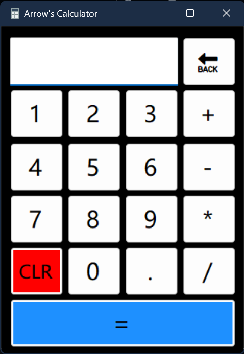

# Windows Calculator

This is a simple Windows Calculator application created using Visual Studio. It allows you to perform basic mathematical operations such as addition, subtraction, multiplication, and division.

## Features

- Basic arithmetic operations (addition, subtraction, multiplication, division).
- User-friendly graphical interface with a numeric keypad and function buttons.
- Clear and easy-to-read display for input and results.

## Acknowledgments

- This project was created as a learning exercise.
- The calculator icon used in this application is courtesy of [icon-icons.com]([https://www.iconarchive.com/show/3d-cartoon-icons-by-deleket/calculator-icon.html](https://icon-icons.com/icon/calculator/34473)).
